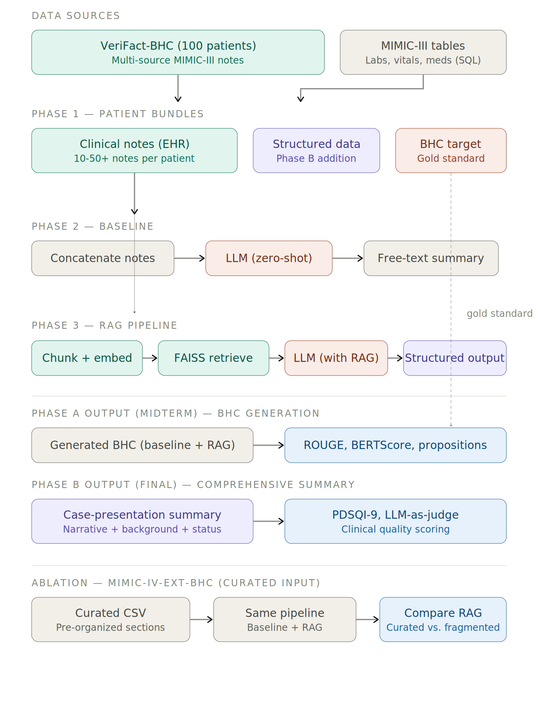
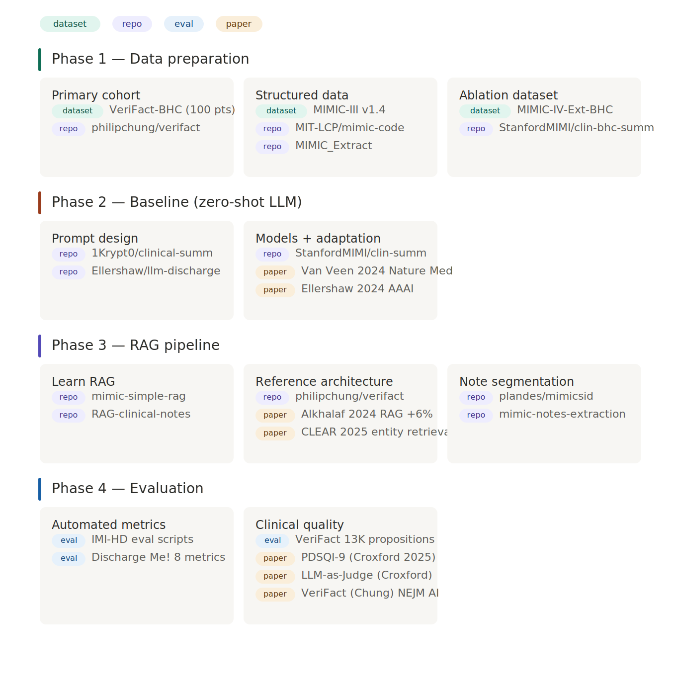
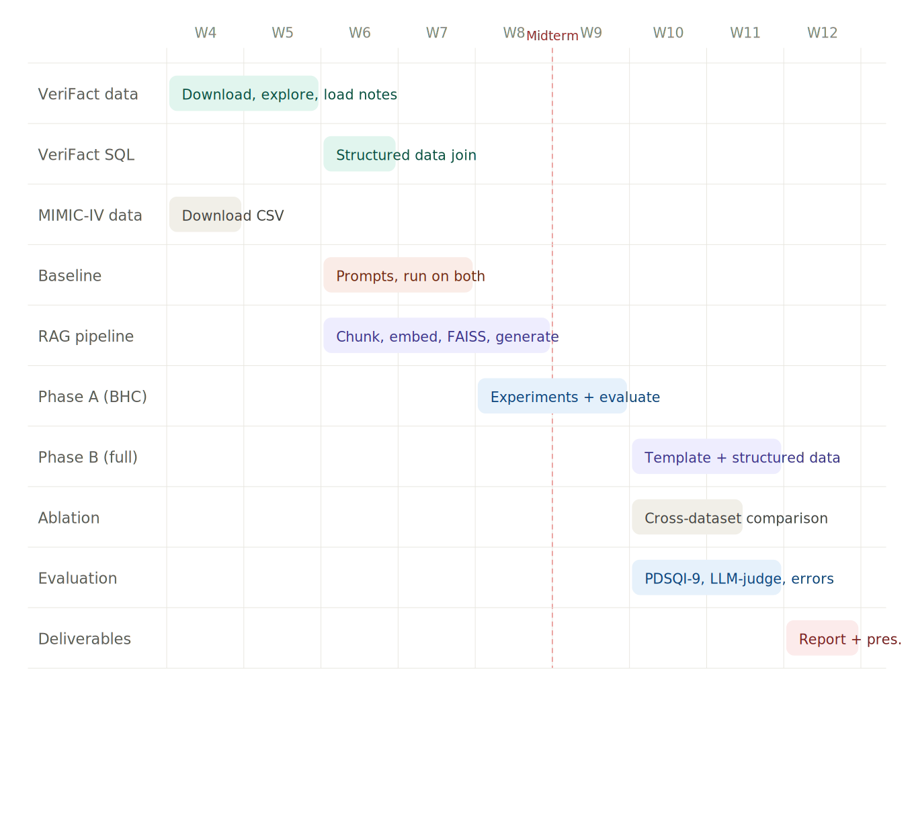

# ICU Patient Summary Generation with LLMs: Project Guide

Ming Lin · Alice Wang · Kelvin Mo · Rodrigo Gameiro

---

## 1. What we are building

We are building a system that takes fragmented ICU patient data (clinical notes, lab results, vitals, medications) and produces a clean, structured patient summary in the format a resident would use when presenting a case to an attending physician.

We compare two approaches:

- **Baseline**: Feed an LLM all the raw clinical notes with a simple prompt (zero-shot). No retrieval, no structure.
- **Proposed method**: Use retrieval-augmented generation (RAG) to find the most relevant information first, then generate a structured summary using a clinical case-presentation template.

The core research question: does the RAG pipeline with structured output produce better summaries than the naive approach, and does it matter more when the source data is fragmented?

---

## 2. Strategy overview

### Primary cohort: VeriFact-BHC (100 MIMIC-III patients)

Our primary dataset is the MIMIC-III-Ext-VeriFact-BHC cohort: 100 patients from MIMIC-III with pre-assembled clinical notes, extracted BHC targets, and 13,070 clinician-annotated propositions. This cohort was specifically curated for LLM-generated clinical text evaluation and each patient is guaranteed to have rich, multi-source documentation.

We use this single cohort for both project phases:

- **Phase A**: BHC generation — retrieve from multi-source clinical notes, generate the Brief Hospital Course, evaluate against the human-written BHC with automated metrics + proposition-level verification.
- **Phase B**: Comprehensive patient summary — same notes plus structured data (labs, vitals, meds via SQL join), generate full case-presentation format, evaluate with PDSQI-9 / LLM-as-judge.

Everything built in Phase A carries forward to Phase B. Same patients, same RAG index, same pipeline,  just a wider output template and additional structured data inputs.

### Ablation study: MIMIC-IV-Ext-BHC (curated input)

As a secondary experiment, we run the same pipeline on the MIMIC-IV-Ext-BHC dataset, where input is already organized (non-BHC sections of the discharge summary) rather than fragmented across multiple notes.

This serves two purposes:

1. **Proof of Concept**: It enables us to test the pipeline in a cleaner and easier to handle dataset
2. **Ablation study**: Comparing RAG improvement on curated input (MIMIC-IV) vs. fragmented multi-source input (MIMIC-III) tests whether retrieval matters more when data is messy, which is the clinically realistic scenario. This is a publishable finding either way.

### Pipeline overview

---

## 3. Why MIMIC-III for the primary cohort

**MIMIC-III** (2001–2012) has **15 categories** of clinical notes in its `NOTEEVENTS` table: Nursing, Nursing/other, Physician, Radiology, ECG, Echo, Discharge summary, Consult, Pharmacy, Nutrition, Rehab Services, Respiratory, Social Work, Case Management, and General. Over 2 million notes total.

**MIMIC-IV-Note** contains only **discharge summaries and radiology reports**. No nursing notes, no physician progress notes, no consult notes.

For our project, MIMIC-III is better because the RAG pipeline works with fragmented, multi-source documentation to retrieve from. MIMIC-IV doesn't have that diversity. The VeriFact-BHC dataset sits on top of MIMIC-III, giving us the best of both worlds: curated patient selection with access to the full note ecosystem.

---

## 4. Key concepts

### What is a Brief Hospital Course (BHC)?

The BHC is a section within a discharge summary that narrates one hospitalization: why the patient came in, what was found, what was done, how they responded, and where things stand at discharge. It requires *synthesis* across days of fragmented documentation, which is why it is the primary target for LLM summarization research and the focus of our Phase A.

### What is RAG (Retrieval-Augmented Generation)?

Instead of feeding all text to an LLM at once, RAG first *retrieves* the most relevant pieces, then gives only those to the model.

1. **Chunk**: Split notes into smaller pieces (~200–500 tokens)
2. **Embed**: Convert each chunk into a vector using a biomedical language model
3. **Index**: Store embeddings in FAISS (fast vector search)
4. **Retrieve**: For each summary section, find the most relevant chunks
5. **Generate**: Give retrieved chunks + structured data to the LLM with section instructions

Benefits: manageable input length, focused context, reduced hallucination.

### What is the case-presentation template?

The output format for Phase B, modeled on how residents present to attendings:

1. **Clinical narrative** — one-liner, HPI, hospital course
2. **Patient background** — PMH, home medications, allergies, social/family history
3. **Current clinical status** — active problems with management, pending workup
4. **Key data** — relevant labs, vitals, significant imaging

### How the ablation study works

**VeriFact-BHC (primary):** Input is 10–50+ separate notes per patient (nursing, physician, consult, radiology). RAG must find relevant information across genuinely fragmented documentation.

**MIMIC-IV-Ext-BHC (ablation):** Input is one organized document per patient (non-BHC sections of the discharge summary). RAG chunks and retrieves from already-structured content.

If RAG improvement is larger on the VeriFact cohort than on the MIMIC-IV dataset, that demonstrates RAG's value increases with input fragmentation, the real-world scenario.

---

## 5. Datasets

### Primary: MIMIC-III-Ext-VeriFact-BHC v1.0.0

- **Source**: PhysioNet — physionet.org/content/mimic-iii-ext-verifact-bhc/1.0.0/
- **Size**: 100 patients from MIMIC-III
- **What's included per patient**:
  - Human-written BHC (extracted from discharge summary) — our gold standard target
  - LLM-generated BHC — additional comparison point
  - Full reference EHR notes in machine-readable and PDF format — our RAG input
  - 13,070 proposition-level annotations (Supported / Not Supported / Not Addressed)
- **Patient selection criteria**: ≥2 physician notes beyond discharge summary, ≥10 total notes per patient
- **Companion code**: github.com/philipchung/verifact (RAG + LLM-as-Judge pipeline)
- **Access**: Requires MIMIC-III credentialed access on PhysioNet

### Primary (structured data supplement): MIMIC-III Clinical Database v1.4

- **Source**: PhysioNet — physionet.org/content/mimiciii/1.4/
- **Role**: We join on `subject_id` and `hadm_id` for our 100 patients to pull structured data not included in VeriFact-BHC
- **Key tables**:

| Table | Contents | Phase |
|---|---|---|
| `LABEVENTS` | Lab results with timestamps | Phase B |
| `CHARTEVENTS` | Vital signs, bedside measurements | Phase B |
| `PRESCRIPTIONS` | Medication orders | Phase B |
| `DIAGNOSES_ICD` | ICD-9 diagnosis codes | Phase B |
| `PROCEDURES_ICD` | Procedure codes | Phase B |
| `ADMISSIONS` | Demographics, admission times | Both |
| `PATIENTS` | Age, sex | Both |

### Ablation: MIMIC-IV-Ext-BHC v1.2.0

- **Source**: PhysioNet — physionet.org/content/labelled-notes-hospital-course/1.2.0/
- **Size**: 270,033 cleaned clinical note–BHC pairs
- **Format**: CSV — download and use immediately, no preprocessing
- **Companion code**: github.com/StanfordMIMI/clin-bhc-summ
- **Role**: Ablation study comparing RAG benefit on curated vs. fragmented input. Also serves as midterm insurance.

### Evaluation reference: "Discharge Me!" Shared Task

- **Source**: physionet.org/content/discharge-me/1.3/
- **Role**: Standard evaluation metrics we adopt (BLEU, ROUGE, BERTScore, AlignScore, MEDCON)

---

## 6. The pipeline, step by step

### Phase 1 — Data preparation

**VeriFact-BHC cohort (primary — both phases):**

1. Download the VeriFact-BHC dataset from PhysioNet
2. Load machine-readable EHR notes per patient (these are the RAG input)
3. Load human-written BHC per patient (this is the Phase A gold standard)
4. For Phase B: run SQL queries against MIMIC-III to pull labs, vitals, meds, diagnoses for the 100 patients by `hadm_id` (use pre-built queries from MIT-LCP/mimic-code)
5. Assemble patient bundles: notes + structured data + BHC target

**MIMIC-IV-Ext-BHC (ablation):**

1. Download the curated CSV from PhysioNet
2. Load into pandas — each row has input (non-BHC sections) and target (BHC)
3. Sample a comparable subset (~100–200 patients) for fair comparison

### Phase 2 — Baseline (zero-shot LLM summarization)

Identical across both datasets and both phases. Only the input text differs.

1. **Concatenate input**: For VeriFact patients, concatenate all clinical notes chronologically. For MIMIC-IV, use the input column directly.
2. **Build prompt**: Simple instruction — "Summarize this patient's hospital course." No examples, no template.
3. **Generate**: Pass to the LLM, collect free-text output.
4. **Store**: Save alongside patient ID for evaluation.

### Phase 3 — RAG pipeline (retrieval + structured generation)

Shared code across both datasets. The pipeline doesn't care where the text came from.

**Step 3.1 — Chunking:**
Split notes into chunks of ~200–500 tokens using section boundaries and paragraph breaks. Tag each chunk with metadata (patient ID, note type, timestamp). Include ~50 token overlap.

**Step 3.2 — Embedding:**
Convert each chunk to a vector using a biomedical embedding model (BioLORD or PubMedBERT-based). Medical embeddings understand that "CHF" = "congestive heart failure" and "WBC 18k" relates to "leukocytosis."

**Step 3.3 — FAISS indexing:**
Build a per-patient FAISS index from all chunk embeddings.

**Step 3.4 — Structured data integration (Phase B only):**
For each template section, pull relevant structured data from the cleaned MIMIC-III tables. Format as text and append to retrieved chunks.

**Step 3.5 — Generation:**

*Phase A (BHC):*
Single retrieval query → retrieve top-K chunks → generate BHC with a focused prompt.

*Phase B (comprehensive summary):*
For each section of the case-presentation template:
1. Convert section query to embedding (e.g., "What are the patient's active problems and current management?")
2. Retrieve top-K relevant chunks from FAISS
3. Append relevant structured data
4. Prompt the LLM with retrieved context + section-specific instructions
5. Assemble all sections into the final structured summary

### Phase 4 — Evaluation

**Phase A evaluation (BHC — midterm):**

| Metric | What it measures | Scope |
|---|---|---|
| ROUGE-L | Lexical overlap with human-written BHC | Full cohort |
| BERTScore | Semantic similarity with human-written BHC | Full cohort |
| Proposition verification | % of generated claims supported by EHR (using VeriFact annotations as reference) | Full cohort |
| PDSQI-9 / LLM-as-Judge | Clinical quality across 9 dimensions | Subset |

**Phase B evaluation (comprehensive summary — final):**

| Metric | What it measures | Scope |
|---|---|---|
| BHC section vs. human BHC | ROUGE-L and BERTScore on the hospital course section only | Full cohort |
| PDSQI-9 / LLM-as-Judge | Clinical quality of the full comprehensive summary | Subset |
| Section-by-section analysis | Which template sections does RAG handle well vs. poorly? | Full cohort |

**Cross-dataset ablation (final paper):**

| Comparison | What it shows |
|---|---|
| RAG improvement on MIMIC-IV (curated input) | Baseline benefit of retrieval on organized data |
| RAG improvement on VeriFact (fragmented input) | Benefit of retrieval on realistic multi-source data |
| Difference between the two | Whether RAG matters more when data is messy |

---

## 7. Code repositories

### Phase 1 — Data preparation

| Repo | What we use it for |
|---|---|
| [philipchung/verifact](https://github.com/philipchung/verifact) | VeriFact pipeline: RAG + LLM-as-Judge on our exact 100-patient cohort. Reference architecture with BGE-M3 embeddings, reranking, and Llama-3.1-70B |
| [MIT-LCP/mimic-code](https://github.com/MIT-LCP/mimic-code) | Pre-built SQL for labs, vitals, severity scores from MIMIC-III |
| [StanfordMIMI/clin-bhc-summ](https://github.com/StanfordMIMI/clin-bhc-summ) | Loading and preprocessing code for MIMIC-IV-Ext-BHC (ablation dataset) |
| [MLforHealth/MIMIC_Extract](https://github.com/MLforHealth/MIMIC_Extract) | Structured time-series extraction from MIMIC-III into HDF5 (Phase B) |

### Phase 2 — Baseline summarization

| Repo | What we use it for |
|---|---|
| [1Krypt0/clinical-summarization-llm](https://github.com/1Krypt0/clinical-summarization-llm) | Prompt templates, BHC regex, 5-LLM comparison on MIMIC-III |
| [StanfordMIMI/clin-summ](https://github.com/StanfordMIMI/clin-summ) | Van Veen et al. — 8 LLMs, QLoRA, ICL, full evaluation pipeline |
| [simonEllershaw/llm-discharge-summaries](https://github.com/simonEllershaw/llm-discharge-summaries) | GPT-4 + clinical guidelines → structured JSON output on MIMIC-III |
| [IMI-HD/llm-discharge-summaries](https://github.com/IMI-HD/llm-discharge-summaries) | Clean prompt/run/eval script templates |
| [epfLLM/meditron](https://github.com/epfLLM/meditron) | Meditron-7B/70B medical LLM base model |

### Phase 3 — RAG pipeline

| Repo | What we use it for |
|---|---|
| [philipchung/verifact](https://github.com/philipchung/verifact) | Reference RAG implementation on our exact cohort (BGE-M3 + FAISS + reranking) |
| [kulsoom-abdullah/mimic-simple-rag](https://github.com/kulsoom-abdullah/mimic-simple-rag) | Beginner-friendly RAG notebook to learn the mechanics |
| [hasnaatmalik/RAG-clinical-notes](https://github.com/hasnaatmalik/RAG-clinical-notes) | Full RAG pipeline: chunking, vector DB, retrieval, generation |
| [plandes/mimicsid](https://github.com/plandes/mimicsid) | Section segmentation for MIMIC-III notes (MedSecId) |

### Phase 4 — Evaluation

| Repo | What we use it for |
|---|---|
| [philipchung/verifact](https://github.com/philipchung/verifact) | Proposition-level fact verification against EHR |
| [StanfordMIMI/clin-summ](https://github.com/StanfordMIMI/clin-summ) | ROUGE, BERTScore, UMLS metrics |
| [IMI-HD/llm-discharge-summaries](https://github.com/IMI-HD/llm-discharge-summaries) | Plug-and-play `compute_bertscore.py`, `compute_rouge.py` |
| [Stanford-AIMI/discharge-me](https://github.com/Stanford-AIMI/discharge-me) | 8-metric evaluation framework |
| [ji-youn-kim/EHRNoteQA](https://github.com/ji-youn-kim/EHRNoteQA) | LLM evaluation methodology |

---

## 8. Key papers

### Clinical summarization with LLMs

| Paper | Key finding | Relevance |
|---|---|---|
| Van Veen et al. (2024), *Nature Medicine* | Adapted LLMs outperform medical experts in 81% of clinical summarization cases | Evaluation methodology, adaptation strategies |
| Williams et al. (2025), *JAMA Internal Medicine* | No quality difference between LLM and physician discharge summaries | Validates clinical plausibility of LLM summaries |
| 1Krypt0 / Rodrigues et al. (2024), *arXiv* | Gemini one-shot best; Mistral competitive after fine-tuning on MIMIC-III | Direct baseline benchmark |
| Ellershaw et al. (2024), *AAAI* | GPT-4-turbo + clinical guidelines achieved 0.81 accuracy on MIMIC-III | Closest to our structured template approach |
| Searle et al. (2023), *J Biomed Inform* | BHC summarization from MIMIC-III, 47,591 admissions, multi-document | Establishes BHC task on MIMIC-III |
| Aali et al. (2024), *JAMIA* | MIMIC-IV-Ext-BHC dataset + LLM benchmarking for BHC summarization | Our ablation dataset |

### RAG for clinical text

| Paper | Key finding | Relevance |
|---|---|---|
| Alkhalaf et al. (2024), *J Biomed Inform* | RAG improved summarization from 93% to 99% with Llama 2 | Core evidence RAG improves clinical summarization |
| Lopez et al. (2025), *npj Digital Medicine* (CLEAR) | Entity retrieval: F1=0.90 vs 0.86 for embedding RAG, 70% fewer tokens | Smarter retrieval strategies outperform naive search |
| CLI-RAG (2025), *arXiv* | Hierarchical chunking + dual-stage retrieval on MIMIC-III; 87.7% temporal alignment | Most relevant RAG architecture for our task |

### Evaluation and fact verification

| Paper | Key finding | Relevance |
|---|---|---|
| Chung et al. (2025), *NEJM AI* (VeriFact) | RAG + LLM-as-Judge achieves 92.7% agreement with clinicians for fact verification | Our primary dataset; provides evaluation framework and reference RAG pipeline |
| Croxford et al. (2025), *JAMIA* (PDSQI-9) | Validated 9-dimension clinical summary scoring rubric | Our clinical quality instrument |
| Croxford et al. (2025), *npj Digital Medicine* | LLM-as-Judge achieves strong agreement with physician evaluators on PDSQI-9 | Scalable clinical evaluation |
| Xu et al. (2024), *BioNLP @ ACL* | 8-metric evaluation framework for discharge summary generation | Standard metrics we adopt |

### Shared task and benchmarks

| Paper | Key finding | Relevance |
|---|---|---|
| Damm et al. / WisPerMed (2024), *BioNLP @ ACL* | Dynamic Expert Selection across 5 models; top score (0.332) | Top-performing benchmark approach |
| Wu et al. / MEDISCHARGE (2024), *BioNLP @ ACL* | Dynamic information selection; Meditron-7B with context extension | Context-window management solution |

---

## 9. Technical stack

| Component | Tool | Why |
|---|---|---|
| Data extraction | SQL (BigQuery or PostgreSQL) | Query MIMIC-III structured tables for 100 patients |
| Data processing | Python, pandas, numpy | Cleaning, structuring |
| Embedding model | BioLORD or BGE-M3 | Biomedical semantic understanding (BGE-M3 used in VeriFact) |
| Vector search | FAISS | Fast similarity search |
| LLM | Llama 3 or Mistral (open-source) | Reproducible, no API costs |
| Fine-tuning (if needed) | LoRA via PEFT / Hugging Face | Parameter-efficient, low compute |
| Evaluation | rouge-score, bert-score (Python) | Automated metrics |
| Fact verification | VeriFact pipeline | Proposition-level evaluation |
| Development | Jupyter, GitHub | Interactive dev + version control |
| Compute | Google Colab → GPU server | Scale as needed |
| Document prep | Overleaf (LaTeX) | Final report |

---

## 10. Week-by-week plan

### Data setup (both tracks in parallel)

**VeriFact-BHC (primary):**
- [ ] Ensure PhysioNet credentialed access to MIMIC-III + VeriFact-BHC
- [ ] Download VeriFact-BHC dataset
- [ ] Explore the data: machine-readable EHR format, note counts per patient, BHC lengths
- [ ] Load and organize notes per patient
- [ ] Identify `hadm_id` list for the 100 patients

**MIMIC-IV-Ext-BHC (ablation / insurance):**
- [ ] Download curated CSV
- [ ] Load into pandas, explore structure
- [ ] Sample ~100–200 patients for ablation comparison

**Structured data (for Phase B, start early):**
- [ ] Set up MIMIC-III database access
- [ ] Write SQL to pull labs, vitals, meds for the 100 VeriFact patients (adapt MIT-LCP queries)

### Pipeline construction

**Build shared pipeline (test on both datasets):**
- [ ] Implement baseline: concatenate → prompt → generate → store
- [ ] Run baseline on VeriFact dev patients (~20), read outputs clinically
- [ ] Study the VeriFact repo and mimic-simple-rag notebook
- [ ] Implement chunking and embedding pipeline
- [ ] Build FAISS index per patient, test retrieval quality
- [ ] Implement BHC generation (Phase A output)
- [ ] Also run baseline + RAG on MIMIC-IV ablation set

### Phase A results + midterm

**Primary results (VeriFact-BHC):**
- [ ] Run baseline + RAG on all 100 VeriFact patients
- [ ] Compute ROUGE-L, BERTScore against human-written BHC
- [ ] Leverage VeriFact proposition annotations for fact-level evaluation
- [ ] Run PDSQI-9 / LLM-as-judge on subset

**Ablation results (MIMIC-IV):**
- [ ] Run same pipeline on MIMIC-IV ablation set
- [ ] Compare RAG improvement across datasets

**Midterm presentation:**
- [ ] Present Phase A results: baseline vs. RAG on both datasets
- [ ] Highlight ablation finding (RAG benefit on fragmented vs. curated input)

### Phase B

- [ ] Integrate structured data (labs, vitals, meds) into the retrieval pipeline
- [ ] Implement full case-presentation template with section-by-section generation
- [ ] Run comprehensive summary pipeline on 100 VeriFact patients
- [ ] Evaluate with PDSQI-9 / LLM-as-judge
- [ ] Section-by-section analysis: which sections does RAG help most?
- [ ] Error analysis and robustness checks

### Final deliverables

- [ ] Write final report (Overleaf) covering:
  - Phase A: BHC generation (baseline vs. RAG, both datasets)
  - Ablation: curated vs. fragmented input comparison
  - Phase B: comprehensive summary with clinical quality evaluation
- [ ] Prepare final presentation
- [ ] Clean up code repository and documentation

---

## 11. References

1. Van Veen, D. et al. (2024). Adapted large language models can outperform medical experts in clinical text summarization. *Nature Medicine*, 30(4), 1134–1142.
2. Williams, C.Y.K. et al. (2025). Physician- and large language model–generated hospital discharge summaries. *JAMA Internal Medicine*, 185(7), 818–825.
3. Alkhalaf, M. et al. (2024). Applying generative AI with retrieval augmented generation to summarize and extract key clinical information from EHR. *Journal of Biomedical Informatics*, 104662.
4. Chung, P. et al. (2025). VeriFact: Verifying Facts in LLM-Generated Clinical Text with Electronic Health Records. *NEJM AI*.
5. Croxford, E. et al. (2025). Provider Documentation Summarization Quality Instrument (PDSQI-9). *JAMIA*, ocaf068.
6. Croxford, E. et al. (2025). LLM-as-a-Judge for clinical summary evaluation. *Nature npj Digital Medicine*.
7. Xu, J. et al. (2024). Overview of the First Shared Task on Clinical Text Generation: RRG24 and "Discharge Me!" *BioNLP @ ACL 2024*, 85–98.
8. Ellershaw, S. et al. (2024). Automated Generation of Hospital Discharge Summaries Using Clinical Guidelines and Large Language Models. *AAAI Spring Symposium*.
9. Damm, H. et al. (2024). WisPerMed at "Discharge Me!" *BioNLP @ ACL 2024*, 105–121.
10. Wu, H. et al. (2024). EPFL-MAKE at "Discharge Me!": MEDISCHARGE. *BioNLP @ ACL 2024*, 696–711.
11. Lopez, K. et al. (2025). Clinical entity augmented retrieval for clinical information extraction. *npj Digital Medicine*.
12. Searle, T. et al. (2023). Discharge summary hospital course summarisation of in patient EHR text. *Journal of Biomedical Informatics*.
13. Aali, A. et al. (2024). A dataset and benchmark for hospital course summarization with adapted large language models. *JAMIA*.
14. Johnson, A.E.W. et al. (2016). MIMIC-III, a freely accessible critical care database. *Scientific Data*, 3, 160035.
15. Landes, P. et al. (2022). A New Public Corpus for Clinical Section Identification: MedSecId. *COLING 2022*, 3709–3721.
